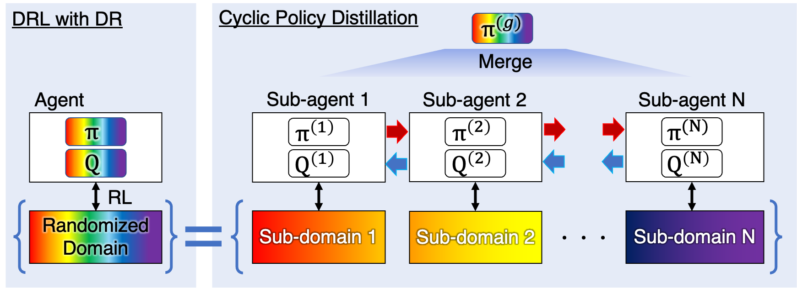

# cyclic-policy-distillation


## Introduction
Deep reinforcement learning with domain randomization learns a control policy in various simulations with randomized physical and sensor model parameters to become transferable to the real world in a zero-shot setting. 
However, a huge number of samples are often required to learn an effective policy when the range of randomized parameters is extensive due to the instability of policy updates. 
To alleviate this problem, we propose a sample-efficient method named Cyclic Policy Distillation (CPD). 
CPD divides the range of randomized parameters into several small sub-domains and assigns a local policy to each sub-domain. 
Then, local policies are learned while cyclically transitioning to sub-domains. Furthermore, CPD accelerates learning through knowledge transfer according to expected performance improvements. 
Finally, all of the learned local policies are distilled into a global policy for sim-to-real transfer. 

## Video
https://youtu.be/UxRnZcLIe3c

## Installation
Optional initial step: create a new python environment with
`python3.8 -m venv CPD` and activate it with
`source CPD/bin/activate`. 

```
cd ~/code/  # code = path where you put the downloaded code
pip install -r requirements.txt
```

## Usage
```
cd ~/code/scripts  # code = path where you put the downloaded code
python root_CPD.py --alpha -1 --seed 0
```
- base reinforcement learning methods is Soft Actor Critic (SAC)
- alpha means policy distillation type
  - alpha = 0 ~ 1: policy distillation with constant rate ( 0 ~ 1 )
  - alpha = -1: policy distillation with optimized rate ( by proposed monotonic policy improvement )
  - alpha = 0: wihout polici distillation ( SAC with cyclic transition )
 
<!-- ## References
If you found this repository helpful, please cite:
```
@article{kadokawa2022cyclic,
  title={Cyclic Policy Distillation: Sample-Efficient Sim-to-Real Reinforcement Learning with Domain Randomization},
  author={Kadokawa, Yuki and Zhu, Lingwei and Tsurumine, Yoshihisa and Matsubara, Takamitsu},
  journal={arXiv preprint arXiv:2207.14561},
  year={2022}
} -->
```


